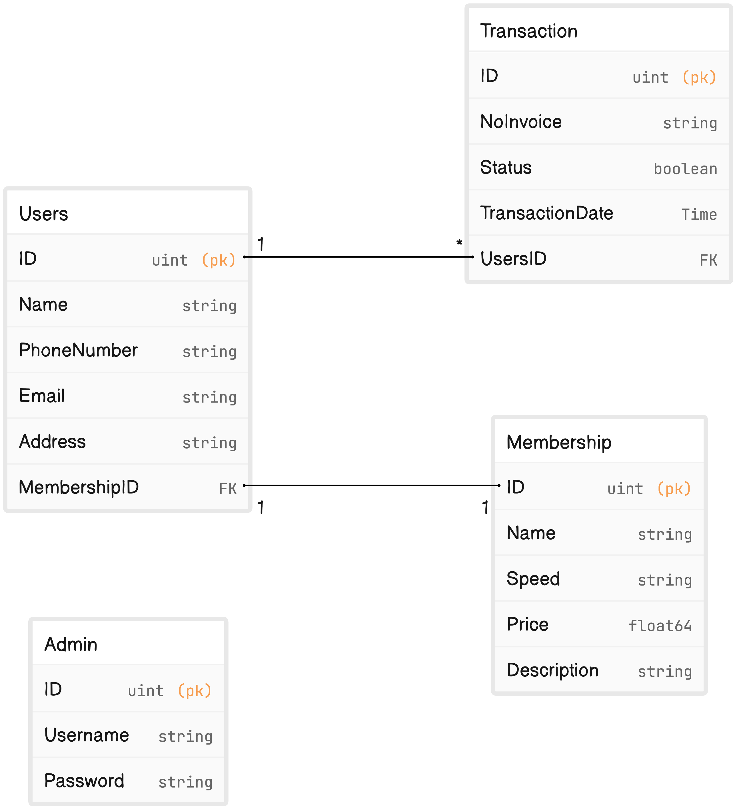

# StarFiber-bot-api

Deskripsi Produk: Proyek ini bertujuan untuk membuat sistem manajemen iuran internet bulanan yang memungkinkan pengguna untuk membayar iuran bulanan mereka dan menerima reminder melalui Telegram Bot. Tujuan produk ini adalah mempermudah pengguna dalam membayar iuran internet dan mengingatkan mereka secara berkala.

## Instalasi

Untuk menjalankan API ini, Anda perlu mengikuti langkah-langkah instalasi berikut:

1. Clone repositori ini ke komputer Anda.
2. Instal semua dependensi yang diperlukan dengan menjalankan perintah `go mod tidy`.
3. Konfigurasi koneksi database MySQL di file `.env` atau konfigurasi yang sesuai.
4. Jalankan API dengan perintah `go run main.go`.
5. API akan berjalan di `http://localhost:1312` secara default.

## Penggunaan API

Anda dapat menggunakan API ini untuk keperluan seperti Pendaftaran Pendaftaran Iuran Internet Bulanan, dapat membuat Admin,Users,Memberships dan Transaksi secara otomatis

## Endpoints

| Route         | HTTP Method | Deskripsi                             | Auth Type         |
| ------------- | ----------- | ------------------------------------- | ----------------- |
| /admins       | POST        | Membuat Admins baru                   | Not Authenticated |
| /admins/login | POST        | Login data admin berdasarkan Admins   | Not Authenticated |
| /admins/:id   | GET         | Mendapatkan data admin berdasarkan ID | Not Authenticated |
| /admins/:id   | PUT         | Mengubah data admin berdasarkan ID    | Not Authenticated |
| /admins/:id   | DELETE      | Menghapus data admin berdasarkan ID   | Not Authenticated |

| Route      | HTTP Method | Deskripsi                            | Auth Type     |
| ---------- | ----------- | ------------------------------------ | ------------- |
| /users     | GET         | Mendapatkan semua data user          | Authenticated |
| /users/:id | GET         | Mendapatkan data user berdasarkan ID | Authenticated |
| /users     | POST        | Membuat user baru                    | Authenticated |
| /users/:id | PUT         | Mengubah data user berdasarkan ID    | Authenticated |
| /users/:id | DELETE      | Menghapus data user berdasarkan ID   | Authenticated |

| Route            | HTTP Method | Deskripsi                                   | Auth Type     |
| ---------------- | ----------- | ------------------------------------------- | ------------- |
| /memberships     | GET         | Mendapatkan semua data membership           | Authenticated |
| /memberships/:id | GET         | Mendapatkan data memberships berdasarkan ID | Authenticated |
| /memberships     | POST        | Membuat membership baru                     | Authenticated |
| /memberships/:id | PUT         | Mengubah data membership berdasarkan ID     | Authenticated |
| /memberships/:id | DELETE      | Menghapus data membership berdasarkan ID    | Authenticated |

| Route             | HTTP Method | Deskripsi                                    | Auth Type     |
| ----------------- | ----------- | -------------------------------------------- | ------------- |
| /transactions     | GET         | Mendapatkan semua data transactions          | Authenticated |
| /transactions/:id | GET         | Mendapatkan data transactions berdasarkan ID | Authenticated |
| /transactions     | POST        | Membuat transactions baru                    | Authenticated |
| /transactions/:id | PUT         | Mengubah data transactions berdasarkan ID    | Authenticated |
| /transactions/:id | DELETE      | Menghapus data transactions berdasarkan ID   | Authenticated |

| Route               | HTTP Method | Deskripsi                  | Auth Type         |
| ------------------- | ----------- | -------------------------- | ----------------- |
| /new                | Post        | Membuat Transaksi otomatis | Not Authenticated |
| /ai-recommendations | Post        | Membuat Rekomendasi AI     | Authenticated     |

## ERD

